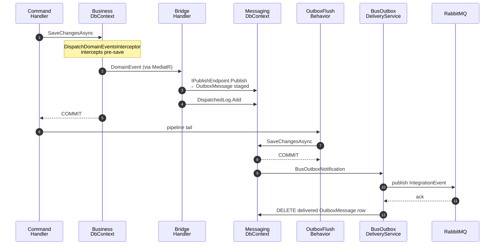

# Architecture

The decisions a future engineer can't recover from source. The code says **what**; this doc says **why**.

## Modular monolith

One deployable, internally structured as modules. Each module lives at
`api/src/Modules/<X>/Pam.<X>/` with its own `DbContext`, schema
(`<module>.*`), aggregates, and feature folders.

**Why not microservices yet:** single deployable, one SQL Server backup, one
connection pool, zero distributed-system tax. The boundary (assembly +
schema + contracts) makes future extraction mechanical.

**Hard rule** — modules communicate **only** via:

1. **Integration events** through MassTransit + RabbitMQ (cross-module facts).
2. **In-process queries** through `IQuery<T>` in `Pam.<Module>.Contracts`.

Never `DbContext` or direct project reference into another module's `Pam.<X>` namespace. Arch tests enforce it.

## Per-module pattern

`Pam.Operators` is the reference. Three projects per module:

| Project | Contents | Who references it |
|---|---|---|
| `Pam.<X>.Contracts` | DTOs, `IQuery<T>`, integration events | other modules, `Pam.Api` |
| `Pam.<X>` | aggregates, features, DbContext, migrations | self only |
| `tests/Pam.<X>.UnitTests` | aggregate + validator tests | none |

**Folder shape inside `Pam.<X>`:**

```
<AggregateName>/
  Models/<Aggregate>.cs
  Features/<UseCase>/
    <UseCase>{Command,Validator,Handler,Endpoint}.cs
  Events/<DomainEvent>.cs
  EventHandlers/<DomainEvent>DomainHandler.cs   # bridges to integration event
  Exceptions/<Aggregate>Errors.cs
Data/
  <Module>DbContext.cs
  <Module>DbContextDesignTimeFactory.cs
  Configurations/<Aggregate>Configuration.cs
  Migrations/
<Module>Module.cs                                # AddXModule + UseXModuleAsync
```

**Wire-up:** `AddXModule(services, config)` registers DbContext +
interceptors + health check; `UseXModuleAsync(serviceProvider)` runs
`db.Database.MigrateAsync()` at startup.

**Persistence rules:**

- Schema-per-module via `modelBuilder.HasDefaultSchema("<module>")` +
  `sql.MigrationsHistoryTable("__EFMigrationsHistory", "<module>")`.
- `options.UseSnakeCaseNamingConvention()` on **both** runtime DbContext
  and design-time factory — or `dotnet ef migrations add` scaffolds
  PascalCase columns.
- Enums as strings: `.HasConversion<string>().HasMaxLength(N)`.
- Audit columns on every entity (`created_at`, `created_by_type`,
  `created_by_id`, `last_modified_*`).

## Identity

Embedded OpenIddict (MIT) + ASP.NET Core Identity. No external IDP process.

- OpenIddict issues OAuth 2.0 / OIDC tokens (AuthZ Code + PKCE, refresh
  with rotation, client_credentials reserved).
- Identity owns users, password hashing, lockout, MFA.
- Both share `IdentityDbContext` in schema `identity`.
- Roles (Owner / Manager / Operator / Accountant) + fine-grained
  permission codes both project as claims; endpoints gate on permissions.

**Why not ZITADEL/Keycloak:** no separate process, no separate DB, no
Brand↔Org sync layer. Trade is more code we maintain; breaking changes
only on deliberate package upgrades. See `DECISIONS.md` #16.

## Brand is a first-class aggregate (`Pam.Operators`)

Multi-brand is core: betanything.eu + planned LATAM/Asia share one PAM.

- `Brand` owns name, slug (unique), jurisdiction, status, audit columns.
- Every brand-scoped aggregate carries `BrandId`.
- Uniqueness enforced by DB `UNIQUE (slug)` + in-handler precheck
  returning typed `AlreadyExistsException` → 409.
- Brand at runtime: anonymous flows take it from a header; back-office
  identities carry `brand_id` as a JWT claim.

When more brand-scoped modules ship, each `DbContext` gains an EF Core
global query filter on `BrandId` to prevent forgot-to-filter leaks.

## Lean integration events, no PII

Events carry IDs and routing only. Email, name, DOB → never. Consumers
that need richer data go through `Pam.<X>.Contracts` queries.

**Why:** events fan out to broker + outbox + audit + every consumer.
PII in events = GDPR right-to-be-forgotten nightmare.

## Error model

RFC 7807 `ProblemDetails`. Stable string codes (`operators.brand.slug-taken`)
under `extensions.code` — clients program against the code, messages can
change freely.

FluentValidation → `ValidationProblemDetails` with per-field errors.
Every response has a `traceId` (W3C Activity ID).

## Endpoint annotations

Mandatory chain on every Carter endpoint:

```
WithTags → WithName → WithSummary → WithDescription (markdown)
  → Accepts<T> → Produces<T> → every ProducesProblem the endpoint can return
  → RequireAuthorization | AllowAnonymous + rate-limit
```

Full spec in [ENDPOINTS](/ENDPOINTS); machine-enforced version in
`CLAUDE.md`. Anti-patterns blocked at review: anonymous response types,
private nested request DTOs, declared status codes the endpoint can't
produce.

## Time

`DateTimeOffset` everywhere, stored as `datetimeoffset`. `IClock` is
injected wherever a timestamp matters.

`DateTime.Now`, `DateTime.UtcNow`, `DateTimeOffset.Now` are banned in
`BannedSymbols.txt`. `DateTimeOffset.UtcNow` allowed only at record-init
defaults where DI is impractical.

## Audit columns

`Entity<TId>` carries `CreatedAt`, `CreatedByType`, `CreatedById`,
`LastModifiedAt`, `LastModifiedByType`, `LastModifiedById`.
`AuditableSaveChangesInterceptor` stamps these on save using `IClock`
+ `IUserContext`.

`IUserContext.Current` returns `Actor(ActorType, Id)` — never null.
`ActorType ∈ {System, Player, Operator, Service, Anonymous}`. Lets you
tell a Player self-suspending vs an Operator suspending them from the
audit columns alone.

## Audit modules — two layers, not the same thing

| Module | Status | Storage | How it captures |
|---|---|---|---|
| **`Pam.Audit`** (singular) | **exists today** | `audit.command_log` | In-process via `AuditBehavior` MediatR pipeline. Every `ICommand` writes a row with actor, correlation id, payload (sensitive fields redacted by `SensitiveJsonRedactor`), timing, success/failure. Queries (`IQuery<T>`) are not audited |
| **`Pam.Audits`** (plural) | future | event-sourced, hash-chained | Subscribes to integration events on the bus; stores `(occurredAt, actor, ip, correlationId, payload, hash, prevHash)` so any tampering is detectable. Lands when a real regulatory requirement demands it |

`Pam.Audit` is the application-level audit log; rows are mutable in
principle (no `UPDATE` paths exist, but nothing prevents one). The
future `Pam.Audits` is the regulator-grade, append-only,
cryptographically chained one.

## Domain events vs integration events

| | Domain event | Integration event |
|---|---|---|
| Scope | Inside one module | Across modules |
| Location | `Pam.<X>/<Concept>/Events/` | `Pam.<X>.Contracts/.../IntegrationEvents/` |
| Stability | Internal — refactor freely | Public contract — versioned |
| Dispatch | In-process via `DispatchDomainEventsInterceptor` (pre-save) | Outbox + MassTransit |
| Naming | `BrandCreated` | `BrandCreatedIntegrationEvent` |

Domain events implement our own `IDomainEvent`, not MediatR's
`INotification`. A wrapper (`DomainEventNotification<TEvent>`) adapts
them so the domain stays framework-free. A bridge handler
(`<Event>DomainHandler`) listens to the domain event and publishes the
matching integration event via `IPublishEndpoint`, preserving the
original `EventId` and `OccurredAt`.

### Integration events describe facts, not commands

```csharp
// WRONG — command dressed as an event; couples publisher to recipient + template
public sealed record SendEmailIntegrationEvent(string To, string Subject, string Body) : IntegrationEvent;

// RIGHT — fact; consumers decide what to do
public sealed record UserLoggedInIntegrationEvent(
    Guid UserId, string IpAddress, string UserAgent, string? DeviceFingerprint
) : IntegrationEvent;
```

`Pam.Notifications` consumes, queries Identity for contact + locale,
decides whether the login warrants an email, renders, sends. The
publisher knows none of that.

### Integration events vs job queues

Both ride RabbitMQ. Different patterns:

| | Integration event | Job queue |
|---|---|---|
| Question | "What happened?" | "When can this work run?" |
| Consumers | Many (fan-out) | One per job |
| Retry/scheduling | Optional | Core feature |
| Coupling | Decouples modules | Decouples request-time from work-time |

Synchronous vs queued, rule of thumb: anything where the user waits for
the result of a **decision** runs synchronously; side effects of that
decision run async.

| Operation | Pattern |
|---|---|
| `POST /login`, `/register`, `/reset-password` | Synchronous |
| Welcome email, SMS, webhook to game provider | Queued |
| Bulk import, daily revenue report | Queued |
| Real-time bet placement | Synchronous (`<50ms` budget) |

`202 Accepted` + job id only for genuinely long-running operations the
user explicitly initiated (e.g. CSV import).

## Notifications and cross-module email

`Pam.Notifications` is the only module with an SMTP gateway. Two paths
into it:

**Path 1 — direct `IEmailSender.SendAsync(...)`** — when the publisher
owns the content AND the payload is sensitive (the token IS the
credential). `Pam.Identity`'s `ForgotPasswordHandler` is the canonical
example. Same for email confirmation and MFA admin reset.

**Path 2 — publish a fact-shaped integration event** — for cross-module
flows where the originating module shouldn't know template, locale, or
brand styling. `Pam.Players` publishes `PlayerRegisteredIntegrationEvent`;
`Pam.Notifications` consumes, queries Players for contact + locale,
renders, sends.

**Why split:** if every module imported `IEmailSender` directly, body
wording + branding + locale resolution would scatter across N modules,
making compliance review and brand updates linear in the number of
modules.

## Aggregate sizing

1. One command modifies one aggregate in one transaction. Two = wrong
   boundary, or you need a saga.
2. Reference other aggregates by ID, never navigation property.
3. Default small. Merge only when an invariant demands atomic writes
   across them.

## Secrets

Two layers:

1. Non-secret config (URLs, log levels, feature flags) →
   `appsettings.{env}.json`, committed.
2. Secrets (connection strings, RabbitMQ passwords, OpenIddict signing
   keys, payment HMACs) → env vars from the host. ASP.NET reads env vars
   over JSON; `__` is the nesting separator
   (`ConnectionStrings__Pam` → `ConnectionStrings:Pam`).

Dedicated secret store (Vault, SOPS, k3s External Secrets) is open;
evaluated when first production deploy lands.

## Outbox + pre-save domain dispatch

Domain events dispatch **pre-save**:
`DispatchDomainEventsInterceptor` overrides `SavingChangesAsync` so
handlers run inside the business `SaveChanges`. Dispatch loop bounded
at 8 generations.

**Topology** — single shared messaging schema. MassTransit 8.5.x can
attach the bus outbox to **one** DbContext only
(`IScopedBusContextProvider<IBus>` is keyed on bus type; MT 9.1's
multi-DbContext outbox is commercial — off-limits per the Apache-2.0
license pin, `DECISIONS.md` #5).

PAM uses one `PamMessagingDbContext` (schema `messaging`, in
`Pam.Shared.Messaging`) that owns `inbox_state`, `outbox_state`,
`outbox_message`. `AddPamMassTransit` calls `UseBusOutbox()` on it.
Module DbContexts carry no outbox entities. See `DECISIONS.md` #26.



### Trade-offs

- **Handlers see pre-commit state** of the business DbContext. A handler
  that queries the DB for freshly-written data will miss it — pass data
  through the event payload.
- **A throwing handler rolls back the business `SaveChanges`** — atomic
  by design. Don't put best-effort side effects (logging, metrics) in a
  domain handler; put them in an integration-event consumer.
- **Atomicity gap** between COMMIT #1 and COMMIT #2. Sub-ms under-deliver
  window. Shared-`SqlConnection` approach was tried + reverted
  (`DECISIONS.md` #28). MT 9.1's fix is license-blocked.
- **Reconciler closes the gap.** Bridge handler writes
  `outbox_dispatched_log` in the same `SaveChanges` as `Publish`, giving
  atomicity within the messaging tier. `OutboxReconciliationService`
  (5-min) republishes business rows whose dispatched-log entry is
  missing.
- **`messaging.outbox_message` is empty in steady state** — the
  delivery service removes delivered rows. Verify activity via API log
  (`Flushed N outbox row(s)`) or RabbitMQ exchange list, not `SELECT
  FROM outbox_message`.

### Scale

`outbox_dispatched_log` is 1:1 with integration events (1 row per
`Publish`). `<module>.<business_table>` is regulator-immutable.

**For `outbox_dispatched_log`:** `OutboxReconciliationService` makes
two passes per cycle.

1. Scan bounded window `(now - LookbackWindow, now - MinAge)` in each
   module's business table. Default 2-day lookback → O(window-size),
   not O(table-size).
2. Batch-delete dispatched-log rows older than `RetentionWindow`
   (default 3 days, must be ≥ `LookbackWindow + safety`).
   `DELETE TOP (N)` keeps each batch below lock-escalation threshold.

PK: `(Module, EventType, BusinessPk)` for IN-list lookup. Non-clustered
index on `DispatchedAt` for the retention sweep.

**For `<module>.<business_table>`:** scan is index-served by
`ix_vendor_transactions_received_at_status` (or the per-module
equivalent). Weekly partitioning on `ReceivedAt` with sliding-window
archival is in place for `ingest.vendor_transactions` — see
`DB_SCALING.md`.

### Adding a publisher

Define a domain event + bridge handler that calls
`IPublishEndpoint.Publish`. No outbox plumbing, no `ConfigureOutbox`,
no package refs — the bus-wide outbox in `Pam.Shared.Messaging` covers
it.

**For Wallet** the outbox is non-negotiable from day one: the
`LedgerEntryPosted` integration event must be transactional with the
ledger row.
