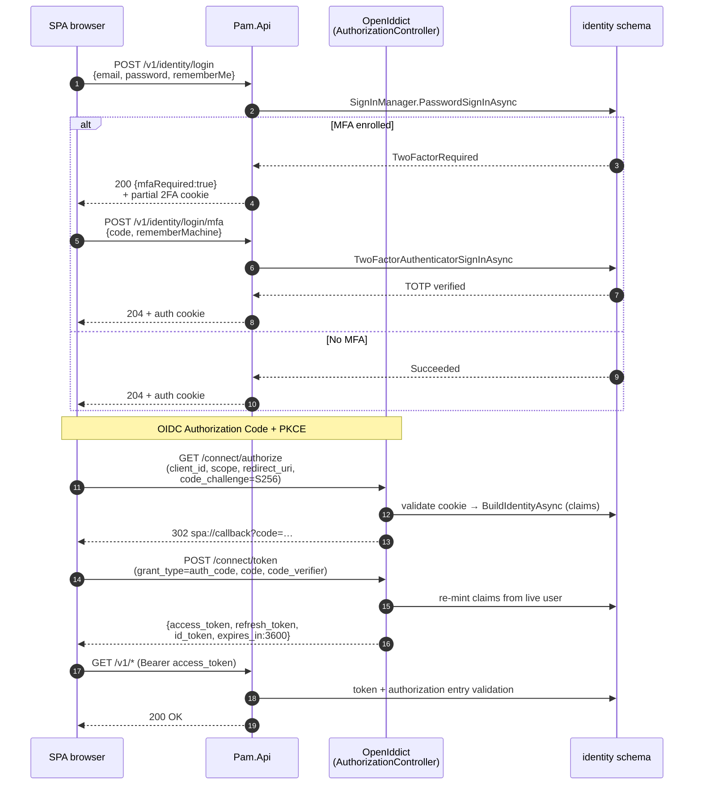

# Authentication and Authorization

End-to-end reference for `Pam.Identity` — the back-office auth module.

**Scope.** Back-office Users only. Players return in Phase 4 under the
same OpenIddict server, different audience (`pam_player_api`). Every
`/v1/*` endpoint that isn't `.AllowAnonymous()` requires a back-office
token.

## Stack

| Layer | What it does |
|---|---|
| OpenIddict | OAuth 2.0 / OIDC issuance + validation. AuthZ Code + PKCE + Refresh. |
| ASP.NET Core Identity | User storage, password hashing, lockout, TOTP. |
| Cookie auth | IDP session. Set on `/v1/identity/login`, read by `/connect/authorize`. |
| Bearer tokens | API auth. `Authorization: Bearer <access_token>` on `/v1/*`. |
| Per-permission policies | Fine-grained authz. One policy per `PermissionCodes` entry. |
| `HttpUserContext` | Translates the OIDC `sub` claim → `Actor` for audit columns. |

Single host, single database. Identity, OpenIddict, and permissions
tables all live in schema `identity`. Why this beats an external IDP:
`DECISIONS.md` #16.

## DB layout (schema `identity`)

```
users                       BackOfficeUser : IdentityUser<Guid> + BrandId + audit
roles                       IdentityRole<Guid>
user_roles                  user ↔ role
user_claims, role_claims    per-user / per-role claims (unused today)
user_logins                 external SSO links (unused today)
user_tokens                 TOTP secret + "remember this machine" cookie pin

permissions                 string codes from PermissionCodes
role_permissions            role ↔ permission

openiddict_applications     OAuth clients (pam-bo today)
openiddict_scopes           pam_api + standard OIDC scopes
openiddict_authorizations   one row per (user, client, scopes) grant
openiddict_tokens           every access / refresh / authcode issued
```

Quartz cleanup job (`UseQuartz()` in `AddCore`) prunes expired and
revoked tokens hourly.

## Roles + permissions

Both project as claims at token-issuance time.

**Roles** (coarse, seeded):

| Role | Default permissions |
|---|---|
| `Owner` | All + `platform.admin` |
| `Manager` | `operators.brands.*`, `identity.users.*`, `identity.roles.write` |
| `Operator` | `operators.brands.read`, `identity.users.read` |
| `Accountant` | `operators.brands.read` |

**Permission codes** (`Pam.Identity.Contracts.Permissions.PermissionCodes`):

```
operators.brands.read
operators.brands.write
identity.users.read
identity.users.write
identity.roles.write
platform.admin              ← Owner-only meta; grants any policy via assertion
```

Endpoints gate on permissions:

```csharp
app.MapPost("/v1/identity/users", ...)
    .RequireAuthorization($"Permissions.{PermissionCodes.Identity.UsersWrite}");
```

`platform.admin` accepts when the user has the specific permission **OR**
the meta one. See `DECISIONS.md` #20.

## Bootstrap — first run

Env vars seed the first Owner:

```
PAM_BOOTSTRAP_OWNER_EMAIL=owner@you.local
PAM_BOOTSTRAP_OWNER_PASSWORD=<initial>
```

`IdentitySeeder.SeedBootstrapOwnerAsync` at startup:

1. If any user with `Owner` role exists → skip.
2. Else if either env var missing → log warning and skip.
3. Else create user with `EmailConfirmed = true` and assign `Owner`.

After the first Owner, env vars are ignored. Every other user is
created via `POST /v1/identity/users` — no self-service back-office
registration (privilege-boundary breach).

## Login sequence

Covers no-MFA, MFA, and recovery code branches plus the OIDC PKCE
handshake. Recovery codes substitute for TOTP at the `/login/mfa` step
with the endpoint `/login/recovery-code` and a one-time hashed code.



`rememberMachine: true` on `/login/mfa` writes a 14-day cookie that
bypasses MFA on this browser for the next login (stored in
`user_tokens` as `[AspNetUserStore].RememberClient`).

## Self-service flows

| Endpoint | Auth | What |
|---|---|---|
| `POST /me/change-password` | authenticated, rate-limited 5/min | `UserManager.ChangePasswordAsync`; security stamp rotates. `currentPassword` required even when authenticated — a captured cookie shouldn't be able to silently weaken auth. |
| `POST /forgot-password` | anon, rate-limited | Always returns 204 (anti-enumeration). If user exists AND confirmed: generate reset token, email link. SMTP failures logged but never surface; email is NOT logged. |
| `POST /reset-password` | anon, rate-limited | `{email, token, newPassword}` → `UserManager.ResetPasswordAsync`; security stamp rotates. |
| `POST /confirm-email` | anon | `{email, token}` → `UserManager.ConfirmEmailAsync`. |
| `POST /me/mfa/enroll` | authenticated | Returns `{sharedKey, authenticatorUri}`. Key persists across re-calls until `SetTwoFactorEnabledAsync(true)` — re-enrolling returns the same key. |
| `POST /me/mfa/verify` | authenticated, rate-limited | `{code}` → `VerifyTwoFactorTokenAsync` + `SetTwoFactorEnabledAsync(true)`. |
| `POST /me/mfa/recovery-codes` | authenticated, rate-limited | Returns 10 plaintext codes ONCE. Stored hashed in `user_tokens`. Re-issuing invalidates previous batch. |
| `POST /me/mfa/disable` | authenticated, rate-limited | `{currentPassword}` → disables MFA + resets authenticator key. |

**Why password challenge on `/me/*` even when authenticated:** a captured
session cookie can't silently change credentials or weaken auth posture.

## Admin operations

All `/v1/identity/users`, gated on `identity.users.{read,write}` or
`identity.roles.write`.

| Method | Path | Permission | Notes |
|---|---|---|---|
| `POST` | `/users` | `identity.users.write` | Create. Auto-fires confirmation email (logged on SMTP failure; admin retry via `/send-confirmation-email`). |
| `GET` | `/users?page=&pageSize=&brandId=&role=&lockedOut=` | `identity.users.read` | Paged list with filters. |
| `GET` | `/users/{id}` | `identity.users.read` | Detail. |
| `PATCH` | `/users/{id}` | `identity.users.write` | Email / BrandId / LockoutEnabled. `null` = no change. |
| `DELETE` | `/users/{id}` | `identity.users.write` | Soft-delete (`LockoutEnd = MaxValue` + stamp rotation). |
| `POST` | `/users/{id}/roles` | `identity.roles.write` | Assign. Idempotent. |
| `DELETE` | `/users/{id}/roles/{role}` | `identity.roles.write` | Remove. Idempotent. |
| `POST` | `/users/{id}/unlock` | `identity.users.write` | Clear lockout. Refuses on soft-deleted users. |
| `POST` | `/users/{id}/mfa/reset` | `identity.users.write` | MFA escape hatch — disables 2FA, resets key, rotates stamp (kills outstanding tokens). |
| `POST` | `/users/{id}/send-confirmation-email` | `identity.users.write` | Re-send. Idempotent — no-op if confirmed. |

**Why soft-delete via lockout:** regulatory retention forbids hard
delete. `LockoutEnd = DateTimeOffset.MaxValue` rides Identity's
existing lockout infra; `SignInManager.PasswordSignInAsync` already
refuses to sign locked-out users in.

**Why role changes rotate the security stamp:** tokens issued before
the change re-validate within the security-stamp interval and pick up
the new claim set. With `EnableAuthorizationEntryValidation`, the
effect is ~immediate.

## Logout — three things you might mean

| Want | Endpoint | What |
|---|---|---|
| End cookie session | `GET\|POST /connect/logout` | Clears auth cookie + redirects to `post_logout_redirect_uri`. Existing access tokens still work for their TTL. |
| Kill refresh token | `POST /connect/revocation` | Marks refresh row revoked. Combined with entry validation, the access token derived from it fails next call. |
| Kill everything | `DELETE /v1/identity/users/{id}` or `POST /v1/identity/users/{id}/mfa/reset` | Rotates security stamp + revokes outstanding authorizations. Instant with entry validation. |

SPA logout should call both `/connect/logout` and `/connect/revocation`.

## Token lifecycle

| Token | TTL | Storage | Rotation |
|---|---|---|---|
| Authorization code | 5 min | `openiddict_tokens` (single-use) | n/a |
| Access token | 1 h | SPA memory | No — get a new one via refresh |
| Refresh token | 14 days | SPA memory + `openiddict_tokens` | **Yes** — on every refresh |
| Auth cookie (IDP session) | 8 h sliding | Browser, `HttpOnly` | Sliding window |
| 2FA "remember machine" | 14 days | Browser + `user_tokens` | No |

### Entry validation

`AddValidation()` is configured with:

```csharp
options.EnableAuthorizationEntryValidation();
options.EnableTokenEntryValidation();
```

Every API call cross-checks the access token's row in
`openiddict_tokens` and its authorization row in
`openiddict_authorizations`. If either is `revoked` or `inactive` →
401. **Revocation is effectively instant.**

**Cost:** 2 extra SQL reads per request, sub-ms each. Fine for the
back-office surface (tens to low-hundreds of operators). For the future
`Pam.GameWallet` host (sub-200ms p99, thousands of rps) this is too
expensive — that host runs its own validation stack without these flags
and accepts short revocation lag.

### How tokens die

| Trigger | Mechanism | Latency |
|---|---|---|
| TTL expires | OpenIddict validation rejects | At expiry |
| `/connect/revocation` called | Token row → revoked | Next call (entry validation) |
| Soft-delete / role change / password reset | Security stamp rotates | Next stamp check (~30 min for cookie; immediate for tokens via entry validation) |

## Cookie vs bearer

After login the SPA has two parallel auth mechanisms:

| | Identity cookie | Bearer token |
|---|---|---|
| Set by | Server on `/v1/identity/login` | Returned by `/connect/token` |
| Stored | Browser `HttpOnly` | SPA memory |
| Sent to | `/connect/*` (automatic) | `/v1/*` (SPA attaches) |
| Purpose | Identifies user TO THE IDP | Authorizes API calls |
| Lifetime | 8h sliding (or browser-close, unless `rememberMe`) | 1h access / 14d refresh |
| Survives browser restart | Only with `rememberMe=true` | No — in memory |

So the "I'm still logged in" state is in the bearer tokens. The cookie
matters when the SPA silently refreshes via `/connect/authorize` — no
prompt because the cookie still proves identity.

### "Remember Me" vs "Remember Machine"

| Flag | Endpoint | Effect |
|---|---|---|
| `rememberMe` | `/v1/identity/login` | Auth cookie becomes persistent (survives browser restart). Doesn't affect tokens or MFA. |
| `rememberMachine` | `/v1/identity/login/mfa` | 14-day 2FA-remembered cookie. This browser bypasses MFA next login. Independent of `rememberMe`. |

## Configuration

Env vars use `__` as nesting separator
(`Identity__BackOfficeSpa__LoginUrl=…`).

### `Identity:BackOfficeSpa` (`BackOfficeSpaOptions`)

| Key | Default | Purpose |
|---|---|---|
| `ClientId` | `pam-bo` | Seeded in `openiddict_applications`. |
| `LoginUrl` | `http://localhost:3000/login` | Cookie middleware redirects here without a session. |
| `ResetPasswordUrl` | `http://localhost:3000/reset-password` | Target of `/forgot-password` email. |
| `ConfirmEmailUrl` | `http://localhost:3000/confirm-email` | Target of confirmation email. |
| `RedirectUris` | `[http://localhost:3000/auth/callback]` | OIDC redirect_uri allowlist. |
| `PostLogoutRedirectUris` | `[http://localhost:3000/]` | OIDC post_logout allowlist. |

### `Notifications:Smtp`

| Key | Default | Production |
|---|---|---|
| `Host` | `localhost` | SMTP relay (SES, SendGrid) |
| `Port` | `1025` (Mailpit) | `587` for STARTTLS |
| `UseStartTls` | `false` | `true` |
| `Username` / `Password` | (none) | provider credentials — env var only for password |
| `FromAddress` | `no-reply@pam.local` | A real domain you control |

### Hardcoded policies (`IdentityModule.cs`)

| Setting | Value | Change via |
|---|---|---|
| Password min length | 12 | `options.Password.RequiredLength` |
| Password complexity | digit + lower + upper + nonalphanumeric, 4 unique chars | `options.Password.*` |
| Lockout | 5 attempts / 15 min | `options.Lockout.*` |
| Cookie sliding expiration | 8h | `options.ExpireTimeSpan` |
| `RequireConfirmedEmail` | **`false`** — created-but-unconfirmed users CAN log in. Flip to `true` in prod. | `options.SignIn.RequireConfirmedEmail` |

### Per-environment

`AddIdentityModule(config, env)` disables OpenIddict's HTTPS requirement
only in Development. In prod the reverse proxy sets
`X-Forwarded-Proto: https`; `app.UseForwardedHeaders()` makes
`Request.IsHttps` true.

`AddDevelopmentEncryptionCertificate()` + `AddDevelopmentSigningCertificate()`
generate self-signed certs in the user profile. **Production must
replace these** with real RSA 2048+ certs, rotated annually.

## What's NOT implemented (intentional)

| Capability | Why deferred | Trigger to revisit |
|---|---|---|
| Self-service back-office registration | Privilege-boundary breach | Never |
| Dynamic client registration | We own every client | Third-party app needs to register |
| WebAuthn / passkeys | TOTP covers MFA threat model | Regulator or customer asks |
| External OIDC federation | No customer asking | Customer / compliance requires SSO. `user_logins` table is ready |
| Active sessions UI / concurrent session limits | Not a regulatory requirement | Operator UX request |
| Player auth | Phase 4. Same OpenIddict server, audience `pam_player_api` | The Players module |

## Adding a new auth-adjacent endpoint

1. New feature folder `Pam.Identity/<area>/Features/<UseCase>/`.
2. Four files: `<UseCase>{Command,Validator,Handler,Endpoint}.cs`.
3. Auth: `.RequireAuthorization($"Permissions.{code}")` (admin),
   `.RequireAuthorization()` (any authenticated), or
   `.AllowAnonymous()` (public).
4. Anonymous flows MUST `.RequireRateLimiting("auth-sensitive")`.
5. Authenticated self-service that exposes secrets or weakens auth
   posture SHOULD `.RequireRateLimiting("auth-sensitive")` too.
6. For email: inject `IEmailSender` from `Pam.Notifications.Contracts`.
   Sensitive content (tokens) → call direct. Cross-module facts →
   publish integration event, consume in `Pam.Notifications/Consumers/`.
