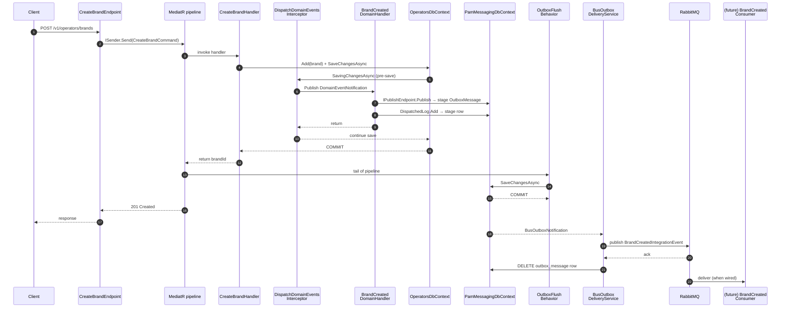

# Events

A walked-through example of the full event loop. `ARCHITECTURE.md` says
*what* the rules are; this doc traces a single request end-to-end so you
can see *how* the rules apply.

The worked example: `POST /v1/operators/brands`. Brand creation is the
smallest publisher in the codebase and exercises every piece of the
pipeline.

## Two kinds of event

| | Domain event | Integration event |
|---|---|---|
| Scope | One module | Across modules |
| Lives in | `Pam.<X>/<Aggregate>/Events/` | `Pam.<X>.Contracts/<Aggregate>/IntegrationEvents/` |
| Stability | Internal — refactor freely | Public contract — versioned |
| Transport | In-process via MediatR (`DomainEventNotification<T>`) | RabbitMQ via MassTransit outbox |
| Naming | `BrandCreatedDomainEvent` | `BrandCreatedIntegrationEvent` |
| Payload | Whatever the aggregate has at hand | IDs and routing only — no PII |

The bridge handler is the only place the two meet. It listens for the
domain event in-process and translates it into the public integration
event.

## The actors

| File | Role |
|---|---|
| `Brand.cs` | Aggregate — raises the domain event |
| `BrandCreatedDomainEvent.cs` | Internal fact |
| `BrandCreatedIntegrationEvent.cs` | Public contract (`Pam.Operators.Contracts`) |
| `BrandCreatedDomainHandler.cs` | Bridge: domain → integration |
| `DispatchDomainEventsInterceptor.cs` | Fires domain events pre-save |
| `OutboxFlushBehavior.cs` | Commits the messaging context at command tail |
| `BusOutboxDeliveryService` (MassTransit) | Reads outbox table, ships to RabbitMQ |
| `OperatorsOutboxReconciler.cs` | Backstop — republishes orphans |

## Step-by-step

### 1. The aggregate raises the domain event

In `Brand.Create`:

```csharp
var brand = new Brand
{
    Id = PamIds.New(),
    Name = name,
    Slug = slug,
    Jurisdiction = jurisdiction,
    Status = BrandStatus.Active,
};
brand.RaiseDomainEvent(
    new BrandCreatedDomainEvent(brand.Id, brand.Name, brand.Slug, brand.Jurisdiction)
);
return brand;
```

The event sits in the aggregate's `_domainEvents` list. Nothing is
dispatched yet.

### 2. Handler saves; interceptor fires pre-save

`CreateBrandHandler` calls `db.SaveChangesAsync()` on `OperatorsDbContext`.
EF Core invokes `DispatchDomainEventsInterceptor.SavingChangesAsync`
**before** the SQL commit. It walks `ChangeTracker.Entries<IAggregate>()`,
finds the new Brand, and for each pending event calls

```csharp
await publisher.Publish(new DomainEventNotification<BrandCreatedDomainEvent>(domainEvent));
```

through MediatR. Wrapping in `DomainEventNotification<T>` keeps the
domain framework-free — the aggregate doesn't reference MediatR.

### 3. The bridge handler runs (in-process)

`BrandCreatedDomainHandler` is the `INotificationHandler` for
`DomainEventNotification<BrandCreatedDomainEvent>`. It stages **two
writes** to the messaging context's change tracker:

```csharp
// (a) MT's bus-wide outbox intercepts Publish and stages an
//     OutboxMessage row in PamMessagingDbContext.
await publisher.Publish(
    new BrandCreatedIntegrationEvent(e.BrandId, e.Slug, e.Jurisdiction)
    {
        EventId = e.EventId,
        OccurredAt = e.OccurredAt,
    },
    cancellationToken
);

// (b) Reconciler proof: "I queued this event for this brand."
messaging.DispatchedLog.Add(new OutboxDispatchedLog
{
    Module = ModuleName,
    BusinessPk = e.BrandId.ToString("N"),
    EventType = nameof(BrandCreatedIntegrationEvent),
    DispatchedAt = clock.UtcNow,
});
```

Neither has been committed to the database yet.

Notice the integration event carries only `BrandId`, `Slug`,
`Jurisdiction` — no display name. That's the *lean event* rule: IDs and
routing. Consumers that need richer data go through
`GetBrandByIdQuery` in `Pam.Operators.Contracts`.

### 4. COMMIT #1 — business row lands

Interceptor returns. EF finishes the SaveChanges on `OperatorsDbContext`
→ `operators.brands` gets the new row. If the bridge handler had thrown,
nothing commits anywhere (the throw rolls back the business save by
design).

### 5. COMMIT #2 — outbox + log land together

MediatR pipeline unwinds. `OutboxFlushBehavior` (innermost behavior)
sees `messaging.ChangeTracker.HasChanges()`, calls
`messaging.SaveChangesAsync()`. Both staged rows commit in one
messaging-context transaction:

```
operators.brands                       ← COMMIT #1
messaging.outbox_message               ← COMMIT #2 (both rows together)
messaging.outbox_dispatched_log
```

There's a sub-ms window between #1 and #2 where a crash leaves the
brand row but no event. That gap is what step 8 covers.

### 6. Delivery to RabbitMQ

`BusOutboxDeliveryService<PamMessagingDbContext>` (a hosted service MT
auto-registers) is woken by `BusOutboxNotification` immediately after
step 5, or polls every 60s if idle. It reads
`messaging.outbox_message`, publishes to the RabbitMQ exchange for
`BrandCreatedIntegrationEvent`, waits for the broker ack, then
`DELETE`s the row.

In steady state `messaging.outbox_message` is empty. Verify activity
through the API log (`Flushed N outbox row(s)`) or the RabbitMQ
exchange list — not `SELECT FROM outbox_message`.

### 7. Consumer in another module

None exist yet for Brand — `Pam.Notifications` will add the first when
welcome-email flow lands. The shape:

```csharp
public sealed class BrandCreatedConsumer(IBrandWelcomeMailer mailer)
    : IConsumer<BrandCreatedIntegrationEvent>
{
    public async Task Consume(ConsumeContext<BrandCreatedIntegrationEvent> ctx)
    {
        // Event is lean (ids + routing). If we need the display name,
        // we query Operators via IQuery<BrandDto>.
        await mailer.SendWelcomeAsync(
            ctx.Message.BrandId,
            ctx.Message.Jurisdiction,
            ctx.CancellationToken);
    }
}
```

MassTransit picks it up via `x.AddConsumers(typeof(NotificationsModule).Assembly)`
in `AddPamMassTransit`. Consumers MUST be idempotent on the business
identity — MT's inbox dedupes envelope `MessageId`, but reconciler
republishes (step 8) get a new envelope `MessageId` each time.

### 8. The reconciler — backstop for the #1↔#2 gap

Every 5 minutes (`OutboxReconciliationService`),
`OperatorsOutboxReconciler.ScanAndRepublishAsync` runs:

1. Scan `operators.brands` for rows where `CreatedAt` falls in
   `(now - 2 days, now - 2 min)` — bounded so the work is O(window),
   not O(table).
2. Cross-reference against `messaging.outbox_dispatched_log` filtered
   by `(Module="Operators", EventType="BrandCreatedIntegrationEvent")`.
3. Any business row WITHOUT a matching log row is an orphan — the
   event never made it past COMMIT #2. Republish through the same
   `Publish` + `DispatchedLog.Add` + `SaveChanges` path.

If step 5 never happened due to a crash, the next reconciler cycle
catches it. Composite PK on `outbox_dispatched_log`
`(Module, EventType, BusinessPk)` makes the republish naturally
idempotent — concurrent retries collide on the PK rather than
double-publishing.

## The whole loop, one diagram



## Invariants worth remembering

- **Domain event = in-process, in-module.** Integration event =
  cross-module, durable, public contract. The bridge handler is the
  only place the two meet.
- **Pre-save dispatch.** Domain handlers run *before* the business
  commit. A throw rolls back the business write — atomic by design.
  Don't put best-effort side effects (logging, metrics, fire-and-forget
  HTTP) in a domain handler; put them in an integration-event consumer.
- **Two commits, both atomic within their tier.** Business row alone
  (#1), then OutboxMessage + DispatchedLog together (#2). The gap
  between is sub-ms, reconciler-covered.
- **Bridge handler must depend on `PamMessagingDbContext`.** Architecture
  test `Bridge_Handlers_Depend_On_PamMessagingDbContext` enforces this
  at PR time. Without the dispatched-log write, the reconciler can't
  detect orphans.
- **Integration events are lean.** IDs and routing only. No PII, no
  display strings. Consumers query through `Pam.<X>.Contracts` for
  richer data.
- **Consumers must be idempotent on the business identity** —
  `BrandId` for Brand, `(VendorId, VendorReference)` for ingest. MT's
  inbox dedupes envelope `MessageId`; reconciler republishes break
  that, so envelope dedupe is not sufficient on its own.

## Where things live

| Concept | Path |
|---|---|
| Domain event type | `api/src/Modules/Operators/Pam.Operators/Brands/Events/BrandCreatedDomainEvent.cs` |
| Integration event type | `api/src/Modules/Operators/Pam.Operators.Contracts/Brands/IntegrationEvents/BrandCreatedIntegrationEvent.cs` |
| Aggregate that raises it | `api/src/Modules/Operators/Pam.Operators/Brands/Models/Brand.cs` |
| Bridge handler | `api/src/Modules/Operators/Pam.Operators/Brands/EventHandlers/BrandCreatedDomainHandler.cs` |
| Reconciler | `api/src/Modules/Operators/Pam.Operators/Brands/Reconciliation/OperatorsOutboxReconciler.cs` |
| Pre-save interceptor | `api/src/Shared/Pam.Shared/Data/Interceptors/DispatchDomainEventsInterceptor.cs` |
| Pipeline behavior | `api/src/Shared/Pam.Shared.Messaging/Behaviors/OutboxFlushBehavior.cs` |
| Messaging DbContext | `api/src/Shared/Pam.Shared.Messaging/Data/PamMessagingDbContext.cs` |
| Dispatched-log entity | `api/src/Shared/Pam.Shared.Messaging/Reconciliation/OutboxDispatchedLog.cs` |
| MassTransit wire-up | `api/src/Shared/Pam.Shared.Messaging/Extensions/MassTransitExtensions.cs` |
| Reconciliation host | `api/src/Shared/Pam.Shared.Messaging/Reconciliation/OutboxReconciliationService.cs` |
| Bridge-handler arch test | `api/tests/Pam.ArchitectureTests/DomainShapeTests.cs` |

For the *why* behind the two-commit shape and the reconciler, see
`ARCHITECTURE.md` "Outbox + pre-save domain dispatch" and `DECISIONS.md`
ADR #28. For the high-volume sibling (vendor ingest), see `INGEST.md` —
same loop, different aggregate.
