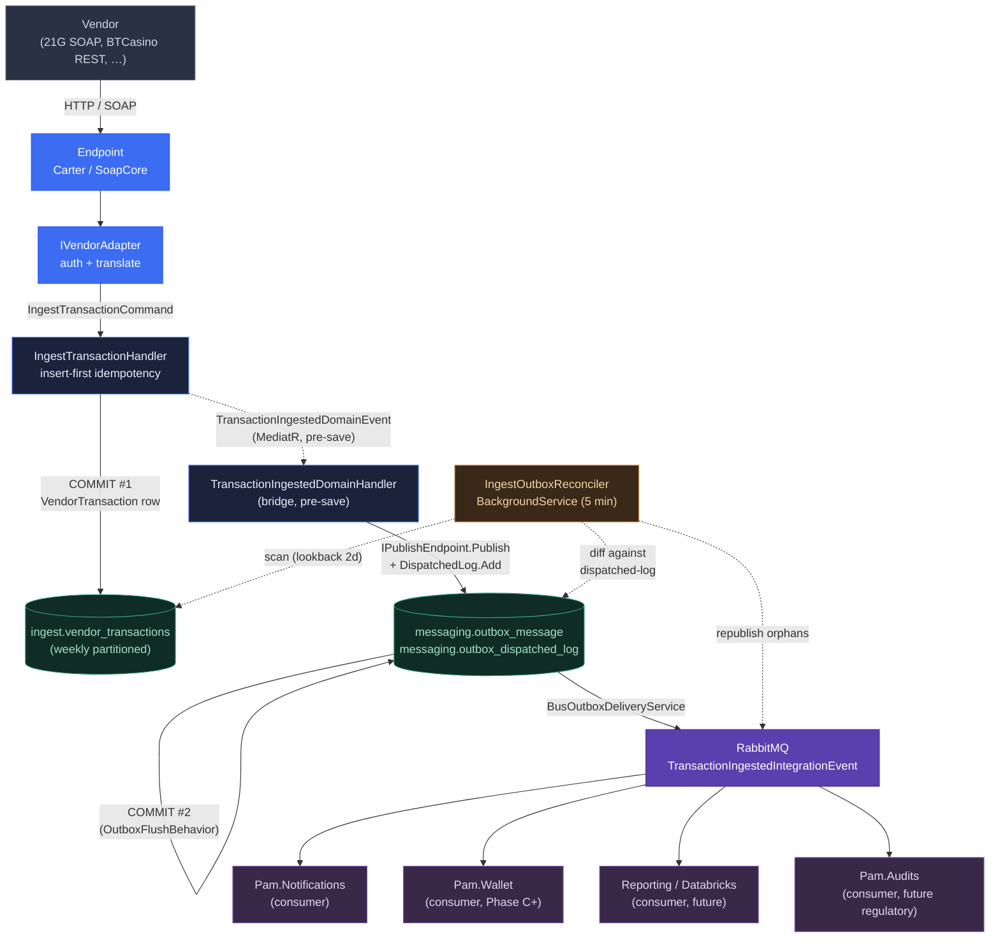

# Ingest

Vendor-agnostic transaction-intercept layer for casinos, lottos, third-party
sportsbooks, horse-racing, cashier. Every vendor's callback funnels through
a vendor-specific adapter into one canonical `VendorTransaction` row in
`ingest.vendor_transactions`. Downstream consumers (wallet posting,
notifications, audit, reporting) consume the resulting
`TransactionIngestedIntegrationEvent` over RabbitMQ.

## Why this exists

GBS's `tbCasinoPlayToday` data model is fine — one row per transaction,
vendor as a `SystemID` discriminator, `Reference` as idempotency key. The
mess is the **integration layer**:

| GBS | PAM |
|---|---|
| One bespoke controller per vendor, no shared abstraction | `IVendorAdapter` seam — one per vendor |
| Auth varies by vendor (plaintext, HMAC-MD5, IP allow-list) | Auth inside the adapter, behind one seam |
| `FLOAT` cents (float on money is a defect class) | `bigint` signed cents |
| `DATETIME` columns without TZ (Roger's Databricks reconciliation pain) | `datetimeoffset` everywhere |
| "Non-posted" baked into table state | `TransactionStatus` enum with explicit lifecycle |
| Casino transactions on a separate UI tab | Single canonical query → unified transaction view |

## Data model (`ingest.vendor_transactions`)

```
id                   uuid PK
vendor_id            varchar(32)         "21g", "btcasino", "vegas", …
vendor_reference     varchar(400)        vendor's transaction id
brand_id             uuid
player_id            uuid
amount_cents         bigint              SIGNED. Risk neg, Win pos.
currency             char(3)             ISO 4217
kind                 varchar(16)         Risk | Win | Refund | Bonus | Correction
status               varchar(16)         Received | Posted | Duplicate | Rejected
round_id             varchar(200) NULL   vendor-supplied; groups per-round events
description          varchar(250) NULL
occurred_at          datetimeoffset      vendor-reported event time
received_at          datetimeoffset      IClock.UtcNow when we wrote it
rejected_reason      varchar(64) NULL
-- audit columns

UNIQUE (vendor_id, vendor_reference)             ix_vendor_transactions_idempotency
INDEX (brand_id, player_id, occurred_at DESC)    ix_vendor_transactions_player_timeline
INDEX (vendor_id, occurred_at DESC)              ix_vendor_transactions_vendor_timeline
INDEX (received_at, status)                      ix_vendor_transactions_received_at_status
```

The unified-view query, one query for every vendor:

```sql
SELECT id, vendor_id, kind, amount_cents, currency, status, occurred_at
FROM ingest.vendor_transactions
WHERE brand_id = $1 AND player_id = $2
ORDER BY occurred_at DESC
LIMIT 100;
```

The table is **weekly-partitioned** on `received_at`, with a daily C#
maintenance service (`PartitionMaintenanceService`) that splits future
boundaries and refreshes hot-partition stats. See `DB_SCALING.md`.

## Three layers

1. **Vendor endpoint** — `/v1/ingest/vendors/{vendor-code}` (Carter) or
   `/integrations/<vendor>/*.asmx` (SoapCore). Anonymous, rate-limited
   via `api-default`.
2. **`IVendorAdapter`** — `AuthenticateAsync`, `TranslateAsync` (vendor
   payload → canonical command), `FormatResponseAsync` (canonical
   result → vendor-shaped reply).
3. **`IngestTransactionHandler`** — vendor-agnostic. Insert-first
   idempotency, persist, raise domain event. Outbox publishes the
   integration event durably (reconciler backstops the atomicity gap).



Endpoint stays thin:

```csharp
app.MapPost($"/v1/ingest/vendors/{VendorCodes.TwentyOneG}",
    async (HttpContext ctx, TwentyOneGAdapter adapter, ISender sender, CT ct) =>
{
    if (!await adapter.AuthenticateAsync(ctx.Request, ct)) return Results.Unauthorized();
    var cmd = await adapter.TranslateAsync(ctx.Request, ct);
    if (cmd is null) return Results.BadRequest(...);
    var result = await sender.Send(cmd, ct);
    return await adapter.FormatResponseAsync(result, ctx.Request, ct);
})
.AllowAnonymous()
.RequireRateLimiting("api-default");
```

Adding a vendor: implement `IVendorAdapter`, register in
`IngestModule.AddIngestModule`, write a Carter `ICarterModule` with the
same five-line shape.

## Idempotency

`(vendor_id, vendor_reference)` is the key. Retries return
`TransactionStatus.Duplicate` and the original row's id.

**Insert-first** — try the write, catch the unique-violation:

```csharp
catch (DbUpdateException ex) when (IsUniqueViolation(ex))   // 2627 / 2601
{
    db.ChangeTracker.Clear();
    var raced = await db.VendorTransactions.AsNoTracking()
        .Where(t => t.VendorId == cmd.VendorId
                 && t.VendorReference == cmd.VendorReference)
        .Select(t => new { t.Id })
        .FirstAsync(cancellationToken);
    return new IngestTransactionResult(raced.Id, TransactionStatus.Duplicate);
}
```

Why insert-first: no pre-read round-trip, scales under high write
throughput, correct under replica races. The duplicate path
`ChangeTracker.Clear()`s before returning so the domain event raised
on the unsaved aggregate is **not** dispatched — vendor retries do not
re-publish.

## Money and time

**Money** — signed `bigint` cents. The adapter applies the sign — PAM
doesn't infer sign from `Kind` because vendors disagree on convention.
21G flips negative for `Risk`, positive for everything else; BTCasino
sends signed values already.

**Time** — two timestamps per row:

- `OccurredAt` — vendor-reported event time (carries clock skew,
  network delay, retry behavior).
- `ReceivedAt` — `IClock.UtcNow` when PAM wrote the row.

Daily-figure reports use `OccurredAt` (business time). SLA / lag metrics
use `(ReceivedAt - OccurredAt)`. Both `datetimeoffset` — no TZ truncation.

## Status lifecycle

```
                          ┌─→ Received   ←─ initial state, balance not yet applied
[vendor callback]  ───────┤
                          ├─→ Duplicate  ←─ (vendor_id, vendor_reference) already exists
                          └─→ Rejected   ←─ validation failed
                                  │
                                  │  (Phase C+, when PAM owns the wallet)
                                  ▼
                              Posted     ←─ wallet authorized + applied
```

In Phase A (intercept-and-forward), every ingest stays at `Received` —
GBS still owns the wallet, so PAM never transitions to `Posted`.
Rejected rows persist as audit records but raise no integration event.

## Strangler-fig phases

| Phase | What | Effect on GBS |
|---|---|---|
| **A — Intercept-and-forward** | PAM hosts the vendor URL, normalizes + persists `Received`, then forwards the original request to GBS verbatim | Zero functional change. PAM gains a clean parallel stream |
| **B — Emit integration events** | `TransactionIngestedIntegrationEvent` published; Databricks reads it (replaces messy joins); Notifications consumes for "tx posted" emails | GBS unchanged; reporting moves off GBS |
| **C — PAM authoritative for one vendor** | PAM stops forwarding for that vendor; PAM calls the GBS stored proc OR (Phase C') writes through to `Pam.Wallet`. One-way sync keeps `tbCasinoPlayToday` for Crystal Reports | Lowest-traffic vendor first |
| **D — All vendors migrated** | `tbCasinoPlayToday` becomes a read-only view fed from `ingest.vendor_transactions` | GBS casino write path retired |

Phases are independently shippable per vendor — one can be at C while
five others are at A.

## Route convention

```
POST /v1/ingest/vendors/{vendor-code}
```

- `.AllowAnonymous()` — adapter handles vendor auth.
- `.RequireRateLimiting("api-default")` — sliding window, 100 req/30s,
  Redis-backed (shared across replicas).
- `.WithTags("Ingest")` — single tag; per-vendor sub-tags would dupe in
  Scalar's nav.
- Full OpenAPI annotation chain (see [ENDPOINTS](/ENDPOINTS)).

Request and response DTOs are public records in a sibling
`<Vendor>Contracts.cs` — OpenAPI/Scalar can't reach private nested
types.

## 21G SOAP listener

The 21G listener mounts at the same paths GBS hosts today, so DNS swap
is path-stable:

```
/integrations/21GCasino/CustomerTransaction21G.asmx
/integrations/21GCasino/ValidateSessionID21GCasino.asmx
/integrations/21GCasino/GetCustomerBalance21GCasino.asmx
```

`UseIngestSoapEndpoints()` is mounted **before** `UseAuthentication()`
in `Pam.Api/Program.cs` — vendor traffic carries no PAM JWT and the
fallback policy would 401 it otherwise. SoapCore short-circuits on path
match.

21G's wire format has no idempotency key, so we hash the request
content (`TwentyOneGReferenceHasher`, SHA-256) into `vendor_reference`.
Signed cents derived from `tranCode` (`D` → negative). `OccurredAt`
parsed from `dailyFigureDate_YYYYMMDD`.

## Smoke test

```bash
# Apply migrations
make -C api migrate-update MODULE=Ingest

# WSDL
curl -s 'http://localhost:5000/integrations/21GCasino/CustomerTransaction21G.asmx?wsdl' | head -40

# Send a SOAP envelope
curl -s -X POST 'http://localhost:5000/integrations/21GCasino/CustomerTransaction21G.asmx' \
  -H 'Content-Type: text/xml; charset=utf-8' \
  -H 'SOAPAction: "http://tempuri.org/PostTransaction"' \
  --data-binary @- <<'EOF'
<?xml version="1.0" encoding="utf-8"?>
<soap:Envelope xmlns:soap="http://schemas.xmlsoap.org/soap/envelope/"
               xmlns:tem="http://tempuri.org/">
  <soap:Body>
    <tem:PostTransaction>
      <tem:systemID>21G</tem:systemID>
      <tem:systemPassword>dev-password</tem:systemPassword>
      <tem:customerID>cust-001</tem:customerID>
      <tem:amount>10.50</tem:amount>
      <tem:tranCode>D</tem:tranCode>
      <tem:tranType>Bet</tem:tranType>
      <tem:dailyFigureDate_YYYYMMDD>20260512</tem:dailyFigureDate_YYYYMMDD>
    </tem:PostTransaction>
  </soap:Body>
</soap:Envelope>
EOF
# Expect first call: <RespMessage>Accepted (PAM Phase A — not yet forwarded to GBS)</RespMessage>
# Expect replay:     <RespMessage>Duplicate — ignored</RespMessage>

# Confirm row written
docker exec pam-mssql /opt/mssql-tools18/bin/sqlcmd -S localhost -U sa -P 'Pam_dev_password_123!' -No -d pam \
  -Q "SELECT TOP 5 vendor_id, amount_cents, kind, status, occurred_at
      FROM ingest.vendor_transactions ORDER BY received_at DESC;"
# Expect: amount_cents = -1050, kind = Risk, status = Received, occurred_at = 2026-05-12 00:00:00+00

# Confirm RabbitMQ exchange exists (delivery service auto-declares it)
docker exec pam-rabbitmq rabbitmqctl list_exchanges name type | grep Pam.Ingest.Contracts
# Expect: fanout Pam.Ingest.Contracts.Transactions.IntegrationEvents:TransactionIngestedIntegrationEvent

# Steady-state outbox table is empty (delivery service removes delivered rows).
# Verify activity via API log ("Flushed N outbox row(s)") or the exchange list.
```

## Built / not built

| Built |
|---|
| `VendorTransaction` aggregate, EF mapping, indexes, UNIQUE constraint |
| `IngestTransactionCommand` + validator + handler (insert-first idempotency) |
| `TransactionIngestedDomainEvent` + bridge → `TransactionIngestedIntegrationEvent` |
| Bus-wide outbox on `PamMessagingDbContext`, `OutboxFlushBehavior`, `IngestOutboxReconciler` (5-min) |
| Weekly partitioning + `PartitionMaintenanceService` (daily) |
| 21G SoapCore listener at GBS URL paths, mounted before auth |
| `TwentyOneGReferenceHasher` (SHA-256 content idempotency, signed cents, `yyyyMMdd` parsing) |

| Not built | Trigger |
|---|---|
| `IGbsRelay` forwarder (intercept-and-forward proxy) | Required before flipping vendor DNS to PAM |
| Real vendor auth (validate `systemID` + `systemPassword` against `ingest.vendor_credentials`) | Before live 21G traffic |
| `IPlayerLookup` from `Pam.Players.Contracts` | Players module ships |
| Schema cleanup: nullable `BrandId`/`PlayerId`; `vendor_customer_id`, `daily_figure_date`, `gbs_reference` cols | Once Players + IGbsRelay exist |
| Other vendor adapters (BTCasino, Vegas, WNet, Pocket) | Per-vendor Phase A rollout |
| `GET /v1/ingest/transactions?brandId=&playerId=` (unified view query) | CS UI consumes it |
| Brand-scoped global query filter | First authenticated player endpoint |
| Reference data sync (`ingest.vendor_transactions` → GBS `tbCasinoPlayToday`) | Phase C |

See [ARCHITECTURE](/ARCHITECTURE#outbox--pre-save-domain-dispatch)
for the outbox + domain-event pattern and `DECISIONS.md` #25 for the
strangler-fig rationale.
