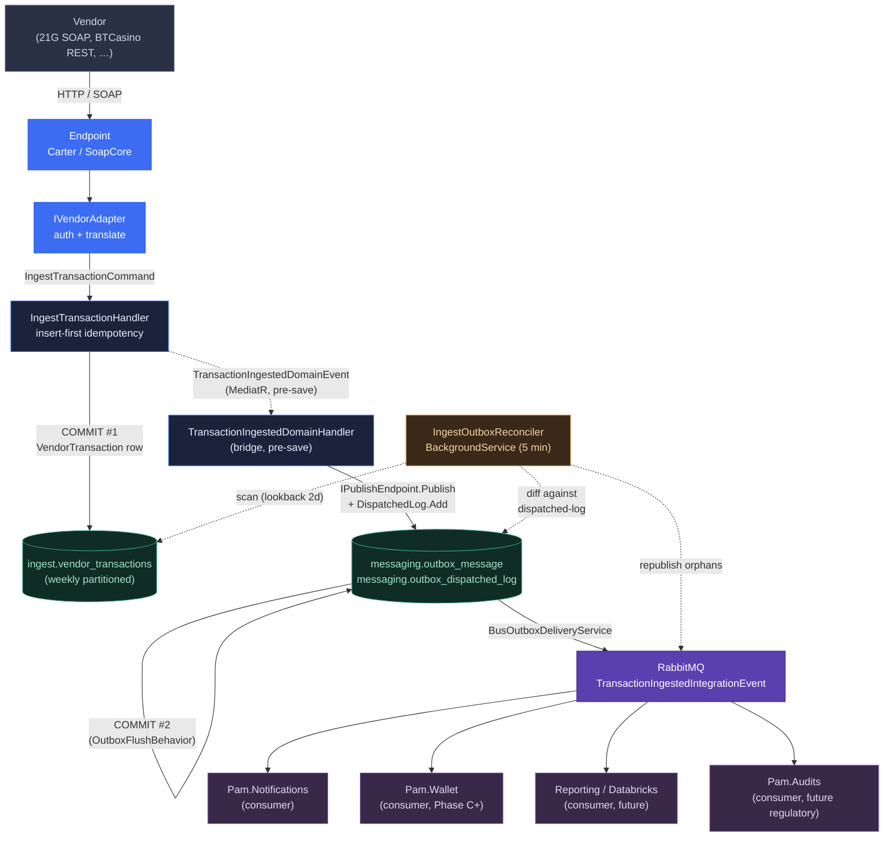
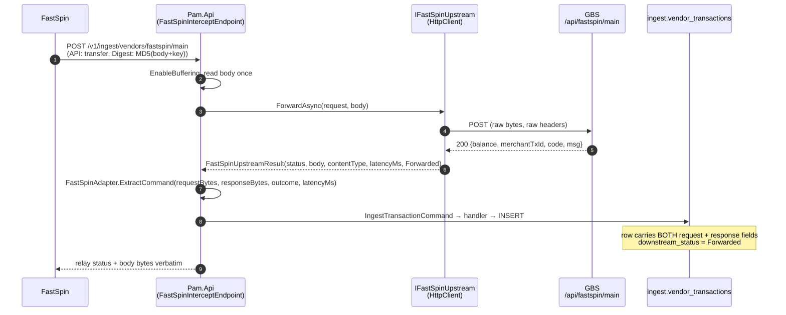

# Ingest

Vendor-agnostic transaction-intercept layer for casinos, lottos, third-party
sportsbooks, horse-racing, cashier. Every vendor's callback funnels through
a vendor-specific adapter into one canonical `VendorTransaction` row in
`ingest.vendor_transactions`. Downstream consumers (wallet posting,
notifications, audit, reporting) consume the resulting
`TransactionIngestedIntegrationEvent` over RabbitMQ.

## Why this exists

GBS's `tbCasinoPlayToday` data model is fine — one row per transaction,
vendor as a `SystemID` discriminator, `Reference` as idempotency key. The
mess is the **integration layer**:

| GBS | PAM |
|---|---|
| One bespoke controller per vendor, no shared abstraction | `IVendorAdapter` seam — one per vendor |
| Auth varies by vendor (plaintext, HMAC-MD5, IP allow-list) | Auth inside the adapter, behind one seam |
| `FLOAT` cents (float on money is a defect class) | `bigint` signed cents |
| `DATETIME` columns without TZ (Roger's Databricks reconciliation pain) | `datetimeoffset` everywhere |
| "Non-posted" baked into table state | `TransactionStatus` enum with explicit lifecycle |
| Casino transactions on a separate UI tab | Single canonical query → unified transaction view |

## Data model (`ingest.vendor_transactions`)

```
id                   uuid PK
vendor_id            varchar(32)         "21g", "btcasino", "vegas", …
vendor_reference     varchar(400)        vendor's transaction id
brand_id             uuid
player_id            uuid
amount_cents         bigint              SIGNED. Risk neg, Win pos.
currency             char(3)             ISO 4217
kind                 varchar(16)         Risk | Win | Refund | Bonus | Correction
status               varchar(16)         Received | Posted | Duplicate | Rejected
round_id             varchar(200) NULL   vendor-supplied; groups per-round events
description          varchar(250) NULL
occurred_at          datetimeoffset      vendor-reported event time
received_at          datetimeoffset      IClock.UtcNow when we wrote it
rejected_reason      varchar(64) NULL
-- Phase-A intercept capture (null/NotApplicable for direct-ingest vendors)
vendor_balance_after_cents  bigint NULL          balance returned by upstream
downstream_reference        varchar(64) NULL     upstream's own tx id (e.g. GBS DocumentNumber)
downstream_outcome_code     int NULL             upstream's response code
downstream_outcome_message  varchar(256) NULL    upstream's response message
downstream_status           varchar(24)          NotApplicable | Forwarded | UpstreamError | UpstreamTimeout | UpstreamUnreachable
downstream_latency_ms       int NULL             wall-clock forward time
-- audit columns

UNIQUE (vendor_id, vendor_reference)             ix_vendor_transactions_idempotency
INDEX (brand_id, player_id, occurred_at DESC)    ix_vendor_transactions_player_timeline
INDEX (vendor_id, occurred_at DESC)              ix_vendor_transactions_vendor_timeline
INDEX (received_at, status)                      ix_vendor_transactions_received_at_status
```

The unified-view query, one query for every vendor:

```sql
SELECT id, vendor_id, kind, amount_cents, currency, status, occurred_at
FROM ingest.vendor_transactions
WHERE brand_id = $1 AND player_id = $2
ORDER BY occurred_at DESC
LIMIT 100;
```

The table is **weekly-partitioned** on `received_at`, with a daily C#
maintenance service (`PartitionMaintenanceService`) that splits future
boundaries and refreshes hot-partition stats. See `DB_SCALING.md`.

## Three layers

1. **Vendor endpoint** — `/v1/ingest/vendors/{vendor-code}` (Carter) or
   `/integrations/<vendor>/*.asmx` (SoapCore). Anonymous, rate-limited
   via `api-default`.
2. **`IVendorAdapter`** — `AuthenticateAsync`, `TranslateAsync` (vendor
   payload → canonical command), `FormatResponseAsync` (canonical
   result → vendor-shaped reply).
3. **`IngestTransactionHandler`** — vendor-agnostic. Insert-first
   idempotency, persist, raise domain event. Outbox publishes the
   integration event durably (reconciler backstops the atomicity gap).



Endpoint stays thin:

```csharp
app.MapPost($"/v1/ingest/vendors/{VendorCodes.TwentyOneG}",
    async (HttpContext ctx, TwentyOneGAdapter adapter, ISender sender, CT ct) =>
{
    if (!await adapter.AuthenticateAsync(ctx.Request, ct)) return Results.Unauthorized();
    var cmd = await adapter.TranslateAsync(ctx.Request, ct);
    if (cmd is null) return Results.BadRequest(...);
    var result = await sender.Send(cmd, ct);
    return await adapter.FormatResponseAsync(result, ctx.Request, ct);
})
.AllowAnonymous()
.RequireRateLimiting("api-default");
```

Adding a vendor: implement `IVendorAdapter`, register in
`IngestModule.AddIngestModule`, write a Carter `ICarterModule` with the
same five-line shape.

## Idempotency

`(vendor_id, vendor_reference)` is the key. Retries return
`TransactionStatus.Duplicate` and the original row's id.

**Insert-first** — try the write, catch the unique-violation:

```csharp
catch (DbUpdateException ex) when (IsUniqueViolation(ex))   // 2627 / 2601
{
    db.ChangeTracker.Clear();
    var raced = await db.VendorTransactions.AsNoTracking()
        .Where(t => t.VendorId == cmd.VendorId
                 && t.VendorReference == cmd.VendorReference)
        .Select(t => new { t.Id })
        .FirstAsync(cancellationToken);
    return new IngestTransactionResult(raced.Id, TransactionStatus.Duplicate);
}
```

Why insert-first: no pre-read round-trip, scales under high write
throughput, correct under replica races. The duplicate path
`ChangeTracker.Clear()`s before returning so the domain event raised
on the unsaved aggregate is **not** dispatched — vendor retries do not
re-publish.

## Money and time

**Money** — signed `bigint` cents. The adapter applies the sign — PAM
doesn't infer sign from `Kind` because vendors disagree on convention.
21G flips negative for `Risk`, positive for everything else; BTCasino
sends signed values already.

**Time** — two timestamps per row:

- `OccurredAt` — vendor-reported event time (carries clock skew,
  network delay, retry behavior).
- `ReceivedAt` — `IClock.UtcNow` when PAM wrote the row.

Daily-figure reports use `OccurredAt` (business time). SLA / lag metrics
use `(ReceivedAt - OccurredAt)`. Both `datetimeoffset` — no TZ truncation.

## Status lifecycle

```
                          ┌─→ Received   ←─ initial state, balance not yet applied
[vendor callback]  ───────┤
                          ├─→ Duplicate  ←─ (vendor_id, vendor_reference) already exists
                          └─→ Rejected   ←─ validation failed
                                  │
                                  │  (Phase C+, when PAM owns the wallet)
                                  ▼
                              Posted     ←─ wallet authorized + applied
```

In Phase A (intercept-and-forward), every ingest stays at `Received` —
GBS still owns the wallet, so PAM never transitions to `Posted`.
Rejected rows persist as audit records but raise no integration event.

## Strangler-fig phases

| Phase | What | Effect on GBS |
|---|---|---|
| **A — Intercept-and-forward** | PAM hosts the vendor URL, normalizes + persists `Received`, then forwards the original request to GBS verbatim | Zero functional change. PAM gains a clean parallel stream |
| **B — Emit integration events** | `TransactionIngestedIntegrationEvent` published; Databricks reads it (replaces messy joins); Notifications consumes for "tx posted" emails | GBS unchanged; reporting moves off GBS |
| **C — PAM authoritative for one vendor** | PAM stops forwarding for that vendor; PAM calls the GBS stored proc OR (Phase C') writes through to `Pam.Wallet`. One-way sync keeps `tbCasinoPlayToday` for Crystal Reports | Lowest-traffic vendor first |
| **D — All vendors migrated** | `tbCasinoPlayToday` becomes a read-only view fed from `ingest.vendor_transactions` | GBS casino write path retired |

Phases are independently shippable per vendor — one can be at C while
five others are at A.

## Route convention

```
POST /v1/ingest/vendors/{vendor-code}
```

- `.AllowAnonymous()` — adapter handles vendor auth.
- `.RequireRateLimiting("api-default")` — sliding window, 100 req/30s,
  Redis-backed (shared across replicas).
- `.WithTags("Ingest")` — single tag; per-vendor sub-tags would dupe in
  Scalar's nav.
- Full OpenAPI annotation chain (see [ENDPOINTS](/ENDPOINTS)).

Request and response DTOs are public records in a sibling
`<Vendor>Contracts.cs` — OpenAPI/Scalar can't reach private nested
types.

## 21G SOAP listener

The 21G listener mounts at the same paths GBS hosts today, so DNS swap
is path-stable:

```
/integrations/21GCasino/CustomerTransaction21G.asmx
/integrations/21GCasino/ValidateSessionID21GCasino.asmx
/integrations/21GCasino/GetCustomerBalance21GCasino.asmx
```

`UseIngestSoapEndpoints()` is mounted **before** `UseAuthentication()`
in `Pam.Api/Program.cs` — vendor traffic carries no PAM JWT and the
fallback policy would 401 it otherwise. SoapCore short-circuits on path
match.

21G's wire format has no idempotency key, so we hash the request
content (`TwentyOneGReferenceHasher`, SHA-256) into `vendor_reference`.
Signed cents derived from `tranCode` (`D` → negative). `OccurredAt`
parsed from `dailyFigureDate_YYYYMMDD`.

## Kingdom Casino (FastSpin) — Phase-A intercept

The Phase-A reference vendor as of 2026-05-13 (replacing 21G — which has
no working QA endpoint right now and stays in the codebase as the SOAP
example). FastSpin is also the first vendor on the **intercept**
pattern: PAM sits transparently between FastSpin and GBS, captures both
directions, and relays GBS's response byte-for-byte. GBS remains the
wallet authority; PAM observes and persists for reporting.

### Flow



### Why intercept, not translate-and-respond

The `IVendorAdapter` pattern (21G, future BTCasino) translates the
vendor's payload to the canonical command and PAM **owns** the
response. That's the right shape for Phase C, when PAM is the wallet
authority. FastSpin is **Phase A**: GBS still owns the wallet; PAM is
inserting itself in the wire for observability without changing what
the vendor sees. Two contracts:

| | 21G adapter (translate) | FastSpin intercept (proxy) |
|---|---|---|
| PAM's role | Sole responder | Transparent observer |
| Response source | PAM builds it | GBS produces it; PAM relays bytes |
| Body re-encoded? | Yes (canonical → vendor shape) | No (would break vendor's `Digest` signature) |
| Persistence trigger | Always (every accepted vendor call) | `transfer` only — `getBalance` is forwarded + relayed, no row |

PAM does NOT validate FastSpin's `Digest: MD5(body+securityKey)`
header — that responsibility stays at GBS. PAM is deliberately
transparent; re-signing or re-encoding the body would break the
contract.

### Wire-shape mapping

```
FastSpin transfer body         →   IngestTransactionCommand
─────────────────────────────────  ──────────────────────────────────────
transferId                     →   VendorReference (idempotency anchor)
acctId                         →   PlayerId (via IPlayerLookup; placeholder today)
amount (double, currency units)→   AmountCents (signed; sign from type)
type=1 (place bet)             →   Kind = Risk, AmountCents negative
type=2 (cancel bet)            →   Kind = Risk, AmountCents negative
type=4 (payout)                →   Kind = Win,  AmountCents positive
type=7 (bonus payout)          →   Kind = Bonus,AmountCents positive
gameCode                       →   Description
referenceId                    →   RoundId
transferTime "yyyyMMddTHHmmss" →   OccurredAt (UTC)

GBS transfer response          →   downstream_* columns
─────────────────────────────────  ──────────────────────────────────────
balance (double, units)        →   vendor_balance_after_cents (×100)
merchantTxId                   →   downstream_reference (GBS's tbcasinoplaytoday.id)
code                           →   downstream_outcome_code
msg                            →   downstream_outcome_message
forward latency                →   downstream_latency_ms
forward outcome                →   downstream_status
```

### `downstream_status` semantics

| Value | What it means | Persisted? | Status relayed to FastSpin |
|---|---|---|---|
| `Forwarded` | GBS responded (any code); response captured | Yes (transfer only) | GBS's actual status (typically 200 with code in body) |
| `UpstreamError` | GBS returned 5xx | Yes | 5xx (relayed unchanged) |
| `UpstreamTimeout` | No response within budget | Yes — we know we *received* it | 503 |
| `UpstreamUnreachable` | Network failure, never reached GBS | **No** — claiming "we received and processed it" would be false | 502 |
| `NotApplicable` | Vendor doesn't use intercept (21G today) | Yes | n/a |

The `UpstreamUnreachable` non-persist case is deliberate: PAM can't
honestly claim the call was processed if we couldn't even reach the
upstream. FastSpin retries with the same `transferId`, and on the
retry that lands at GBS we persist with `Forwarded`.

### Config

```json
{
  "Ingest": {
    "Vendors": {
      "FastSpin": {
        "UpstreamUrl": "https://dev-gbs-api-dbdev.lucky99.eu/fastspin/api/fastspin/main",
        "TimeoutSeconds": 30
      }
    }
  }
}
```

`UpstreamUrl` is validated at startup (`ValidateOnStart` — missing or
empty fails the host build with a clear message rather than silently
forwarding nowhere).

### Idempotency under intercept

Two independent idempotency tiers, on the same `transferId`:

1. **PAM:** `(vendor_id, vendor_reference)` UNIQUE index on
   `ingest.vendor_transactions`. Insert-first; `DbUpdateException`
   with SQL error 2627/2601 → return Duplicate with the original row's id.
2. **GBS:** `tbcasinoplaytoday.Reference` UNIQUE. Returns its existing
   `DocumentNumber` with `TranStatus='D'` on retry.

A retry from FastSpin first re-runs through PAM's idempotency check
(would return the existing row's id). Or if the FIRST attempt persisted
but PAM crashed before relaying, the SECOND forward hits GBS, GBS
returns the same `DocumentNumber`, and PAM's insert collides on the
unique index. Either way: one PAM row, one GBS row, one logical event.

A subtle case: if the FIRST forward got `UpstreamTimeout` (persisted
with timeout status) and the SECOND succeeds (`Forwarded`), the
existing PAM row stays as `UpstreamTimeout` — we don't upgrade the
status on retry. The `downstream_reference` from the successful retry
lives in GBS's row instead. Acceptable for Phase A; revisit if it
matters operationally.

## Smoke test

```bash
# Apply migrations
make -C api migrate-update MODULE=Ingest

# WSDL
curl -s 'http://localhost:5000/integrations/21GCasino/CustomerTransaction21G.asmx?wsdl' | head -40

# Send a SOAP envelope
curl -s -X POST 'http://localhost:5000/integrations/21GCasino/CustomerTransaction21G.asmx' \
  -H 'Content-Type: text/xml; charset=utf-8' \
  -H 'SOAPAction: "http://tempuri.org/PostTransaction"' \
  --data-binary @- <<'EOF'
<?xml version="1.0" encoding="utf-8"?>
<soap:Envelope xmlns:soap="http://schemas.xmlsoap.org/soap/envelope/"
               xmlns:tem="http://tempuri.org/">
  <soap:Body>
    <tem:PostTransaction>
      <tem:systemID>21G</tem:systemID>
      <tem:systemPassword>dev-password</tem:systemPassword>
      <tem:customerID>cust-001</tem:customerID>
      <tem:amount>10.50</tem:amount>
      <tem:tranCode>D</tem:tranCode>
      <tem:tranType>Bet</tem:tranType>
      <tem:dailyFigureDate_YYYYMMDD>20260512</tem:dailyFigureDate_YYYYMMDD>
    </tem:PostTransaction>
  </soap:Body>
</soap:Envelope>
EOF
# Expect first call: <RespMessage>Accepted (PAM Phase A — not yet forwarded to GBS)</RespMessage>
# Expect replay:     <RespMessage>Duplicate — ignored</RespMessage>

# Confirm row written
docker exec pam-mssql /opt/mssql-tools18/bin/sqlcmd -S localhost -U sa -P 'Pam_dev_password_123!' -No -d pam \
  -Q "SELECT TOP 5 vendor_id, amount_cents, kind, status, occurred_at
      FROM ingest.vendor_transactions ORDER BY received_at DESC;"
# Expect: amount_cents = -1050, kind = Risk, status = Received, occurred_at = 2026-05-12 00:00:00+00

# Confirm RabbitMQ exchange exists (delivery service auto-declares it)
docker exec pam-rabbitmq rabbitmqctl list_exchanges name type | grep Pam.Ingest.Contracts
# Expect: fanout Pam.Ingest.Contracts.Transactions.IntegrationEvents:TransactionIngestedIntegrationEvent

# Steady-state outbox table is empty (delivery service removes delivered rows).
# Verify activity via API log ("Flushed N outbox row(s)") or the exchange list.
```

## Built / not built

| Built |
|---|
| `VendorTransaction` aggregate, EF mapping, indexes, UNIQUE constraint |
| `IngestTransactionCommand` + validator + handler (insert-first idempotency) |
| `TransactionIngestedDomainEvent` + bridge → `TransactionIngestedIntegrationEvent` |
| Bus-wide outbox on `PamMessagingDbContext`, `OutboxFlushBehavior`, `IngestOutboxReconciler` (5-min) |
| Weekly partitioning + `PartitionMaintenanceService` (daily) |
| 21G SoapCore listener at GBS URL paths, mounted before auth (kept as the SOAP reference; QA endpoint is offline) |
| `TwentyOneGReferenceHasher` (SHA-256 content idempotency, signed cents, `yyyyMMdd` parsing) |
| **FastSpin (Kingdom Casino) intercept** — `FastSpinInterceptEndpoint`, `IFastSpinUpstream` (typed HttpClient), `FastSpinAdapter`, full intercept-and-forward with combined-fields persistence |
| `downstream_*` capture columns on `vendor_transactions` (vendor_balance_after, downstream_reference, outcome code/msg, status, latency) |

| Not built | Trigger |
|---|---|
| Real vendor auth at PAM edge (when we stop being transparent on the Digest header) | When IP allowlist alone is insufficient |
| `IPlayerLookup` from `Pam.Players.Contracts` | Players module ships |
| Schema cleanup: nullable `BrandId`/`PlayerId`; `vendor_customer_id`, `daily_figure_date`, `gbs_reference` cols | Once Players ships |
| Other vendor adapters (Vegas, Mancala, Betsoft) | Per-vendor Phase A rollout — see `internal/ROADMAP.md` for the order |
| `GET /v1/ingest/transactions?brandId=&playerId=` (unified view query) | CS UI consumes it |
| Brand-scoped global query filter | First authenticated player endpoint |
| Reference data sync (`ingest.vendor_transactions` → GBS `tbCasinoPlayToday`) | Phase C |

See [ARCHITECTURE](/ARCHITECTURE#outbox--pre-save-domain-dispatch)
for the outbox + domain-event pattern and `DECISIONS.md` #25 for the
strangler-fig rationale.
